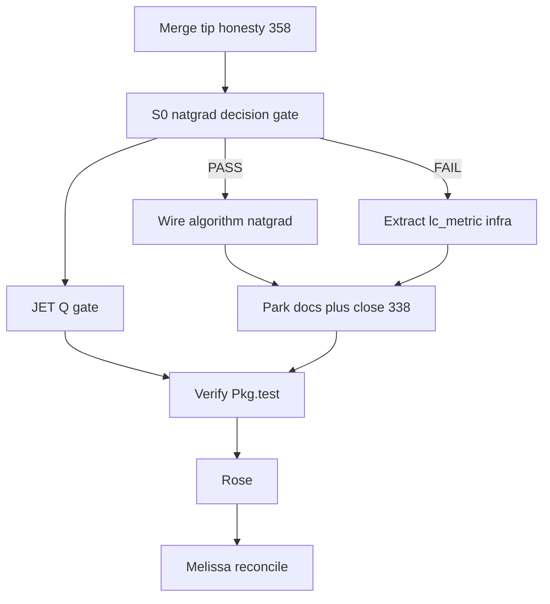

# Approved plan — issue #291 Arc 0: REML baseline ladder

G0 was approved by Shinichi on 2026-08-02. This file freezes the executable
scope; it is not a fresh design exercise.

## Objective
Prepare the evidence and design boundary for the first, small Gaussian q4 REML
acceleration slice. The deliverable is a baseline, not an accelerated estimator.

## Arc 0
1. Write a short Gaussian q4 REML acceleration design-boundary note. State the
   restricted objective and parameter boundary; distinguish the existing baseline
   finite-difference REML optimizer from any later exact-Gaussian AI / observed-
   information candidate. `lc_metric` may be cited as future infrastructure only.
   Do not make a public AI-REML claim.
2. Add a reproducible small-fixture harness comparing ML and *baseline* REML.
   Its report must record repository SHA, dirty state, Julia version, Julia
   threads, BLAS configuration, timing, convergence, objective, estimates, and
   CI/status. Keep the fixture small; no 10k benchmark.
3. Add a focused test for the report contract and wire it into `test/runtests.jl`.
   Document one runnable invocation as a worked note.
4. Run the harness and relevant tests locally. Read the actual report/logs.
5. Add a check-log entry, after-task report, and Rose claim-vs-evidence audit.
   Commit scoped paths and push the branch.

## Non-goals / fences
- No `src/` change, no experimental prototype, and no `:natgrad` / public AI-REML API.
- No bridge API, issue #136, `.worktrees/`, General / Registrator, or public
  speed headline.
- Do not claim acceleration without an estimate, objective, and interval-status
  agreement gate. Future candidates require a new approved arc.

## Gates
- G0: approved.
- OPEN GATE after local verification: opening or merging a public PR, publishing,
  a public speed claim, or heavy compute.

---

# Archived prior plan — non-authoritative for issue #291

> Retained only as prior LOOP history. `#291` is governed exclusively by the
> approved Arc 0 plan above; none of the following Phase 1.0 scope is authorized
> by this branch.

# Phase 1.0 remainder (#3) — Ultra Plan

```
GOAL (paste-ready)
PLATFORM: Cursor (Shannon+Ada). HANDS TO: /goal after G0 (same platform; Totoro for
heavy Q/multi-shape if needed; Codex only if owner reassigns live toolchain).
DELIVERABLE: SCOPED Phase 1.0 closeout — #13 decision gate resolved (wire :natgrad OR
lc_metric infra), JET Workflow Q gap closed, leftover experimental/ parked with
Rose-honest tip docs, #338 tracker closed (content already on tip via #339).
HEADLINE: resolve #13 per report/wire-em-solvers-design.md without overselling a
stalling EM as a public solver.
IN PARALLEL: tip-honesty merge hygiene (#358/#887) ‖ S0 gate prep ‖ JET scout.
DEFER/FENCE: JuliaRegistrator/General (D-111); FULL wire of all 14 experimental/
prototypes; #136 VA; #291 REML speed; AGENTS fence commits; Workflow R first run
(park unless Arc under-runs).
DISCIPLINE: failing/decision test first for #13 · verify before claim · Totoro for
multi-shape/heavy · Rose claim-vs-evidence · Melissa plan-actual at close.
```

**ARC PROGRAM:** mode=size · ~8 h · Arc 0 = #13 decision gate (60–90 min) · under-run → JET + park docs · integrate/close reserved · Actuals → `docs/dev-log/plan-actual/2026-08-01-phase10-remainder.md` (date may slip).

**Locked default (Ada):** SCOPED `#3` — **not** dump-all-experimental. Follow [`report/wire-em-solvers-design.md`](report/wire-em-solvers-design.md) #13 rules. `#12` already shipped (`algorithm = :em`).

---

## Phase 0.25 sweep receipt

| Surface | Evidence | Finding | Call |
|---|---|---|---|
| repo git | `git status -sb`; open [#358](https://github.com/itchyshin/DRM.jl/pull/358); tip honesty branch 1 ahead of main | tip-honesty open; `?? .worktrees/` | merge #358 before engine PR base; leave worktrees |
| experimental map | [explore recon](81e8e005-70fd-4978-a9de-0401b134645b) | 14 unwired files; promotions already in `inference`/`reml_q4`/`location_only` | build gap = #13 + JET + park |
| design reuse | [`report/wire-em-solvers-design.md`](report/wire-em-solvers-design.md); remote `origin/design-wire-em-solvers-12-13` unmerged | #13 = decision gate; #12 done | **reuse design**; do not rewrite |
| twin | n/a for natgrad wire | solver is Julia-only | n/a |
| brain | MCP search Phase 1.0 / Q2 SCOPED | last LOOP held Q2 SCOPED; #13 deferred | continue SCOPED |
| Verdict | | Genuine gap = #13 gate + JET + tip tracker honesty | **build-the-gap** |

**LUNA SUITABILITY:** yes — RECON inventory + mechanical JET/test greps.  
**ULTRA EFFORT:** no.  
**SEARCH / NotebookLM:** none (wiring existing code; no novelty claim).  
**Phase 0.3b:** glance Settings → Usage both bars before `/goal`.

---

## WHAT THE BRAIN / REPO ALREADY KNOW

- `#12` conjugate EM is public (`algorithm = :em`).
- `#13` design: wire `:natgrad` **only if** head-to-head vs `fit_q4_sparse_tmb` clears stall; else extract `lc_metric` for AI-REML infra ([`report/wire-em-solvers-design.md`](report/wire-em-solvers-design.md) L47–74, L100–101).
- Workflow Q: FD/Allocs/multi-shape evidenced June; **JET missing**; ROADMAP still unmarked.
- `#338` content on tip via #339; issue still OPEN (close-only).
- D-111 General OUT; tip honesty PRs in flight.

## WHAT THE TEAM RAISED

- **Noether** — #13 is a decision gate, not a reflex wire · verified-negative plain EM stall · recommend gate-first · default: infra extract if fail  
- **Rose** — do not claim “faster solver” without reconciled logLik · park leftovers explicitly · default: experimental opt-in only  
- **Karpinski** — JET is the standing Q hole · cheap high leverage · default: add gate this arc  
- **Ada** — SCOPED `#3`; merge tip-honesty first; hand long run to `/goal`

## DECISIONS LOCKED

| ID | Decision |
|---|---|
| D-scope | SCOPED Phase 1.0 — not full experimental dump |
| D-13 | Run decision gate; wire `:natgrad` **iff** MLE parity; else `lc_metric` infra + close #13 honestly |
| D-q | Add JET; refresh ROADMAP Q checkmarks for already-green FD/Allocs/multi-shape |
| D-park | Remaining experimental/ stays unwired; tip docs say so |
| D-338 | Close #338 after confirm tip file exists (no rewrite) |
| D-fence | No Registrator; no `#136`/`#291`; no AGENTS fence dumps |

## QUESTIONS STILL OPEN

None blocking. (Owner glance Usage % optional.)

---

## Slice table

| Slice | Member | Bar / model | Time | Detail | Dep |
|---|---|---|---:|---|---|
| S0 RECON | Hopper/Noether scout | Cursor Models · Composer/Grok | 45–60m | Reproduce #13 gate: `fit_em_natgrad` vs sparse TMB on q4_p100; write brief to `docs/dev-log/plans/2026-08-01-natgrad-decision-gate.md` with PASS/FAIL + numbers | tip base clean |
| S1a WIRE | Noether | Cursor Models · Composer (or hand Claude if repair loops) | 3–4h | **If S0 PASS:** promote into public path as `algorithm = :natgrad` (experimental); tests + docstring | S0 PASS |
| S1b INFRA | Noether | Cursor Models · Composer | 2–3h | **If S0 FAIL:** extract `lc_metric` to gradient utils; unit test; do **not** expose solver; close #13 as infra | S0 FAIL |
| S2 JET | Karpinski | Cursor Models · Composer | 1–2h | Add JET gate test/docs; laptop smoke; Totoro if heavy | S0 done (parallel OK with S1) |
| S3 PARK+DOCS | Rose/Pat | Cursor Models · Composer | 45–60m | ROADMAP/#3 honesty; park list; close #338; check-log.d + after-task | S1 done |
| S4 VERIFY | Hopper | Cursor Models · Composer | 45m | `Pkg.test` smoke; assert #13 outcome; JET runs | S1+S2 |
| S5 ROSE | Rose | Other Models · Auto Cost / Claude | 30m | Claim-vs-evidence; no oversell | S4 |
| RECONCILE | Melissa | Other Models · Auto Cost | 20m | `docs/dev-log/plan-actual/YYYY-MM-DD-phase10-remainder.md` | S5 |

**PARALLEL after S0:** S1a XOR S1b ‖ S2. **SEQUENTIAL:** S3←S1; S4←S1+S2; S5←S4; RECONCILE←S5.

**FAN-OUT BUDGET:** checkpoint=`phase10-2026-08-01` · children ≤4 · scout 1 · ceiling 0 (unless #13 math stuck → hand Claude/Codex) · no Sol by default.



---

## Files (expected)

- [`src/experimental/fit_em_natgrad.jl`](src/experimental/fit_em_natgrad.jl) — source
- [`src/DRM.jl`](src/DRM.jl) / fit dispatch — only if S1a
- New or existing gradient util module — if S1b
- `test/` — #13 gate test + JET test
- [`ROADMAP.md`](ROADMAP.md), [`HANDOVER.md`](HANDOVER.md) — Phase 1.0 / Q honesty
- [`report/wire-em-solvers-design.md`](report/wire-em-solvers-design.md) — reuse, maybe status tick
- `docs/dev-log/plans/2026-08-01-natgrad-decision-gate.md` — S0 artefact
- after-task + check-log.d + plan-actual

**Do not touch:** Registrator prep; `.worktrees/`; AGENTS fence commits; `#136`/`#291` implementation.

---

## Preflight before `/goal`

1. Merge [#358](https://github.com/itchyshin/DRM.jl/pull/358) (+ drmTMB [#887](https://github.com/itchyshin/drmTMB/pull/887) if still open) when CI green.
2. Branch engine work from updated `origin/main`.
3. Totoro for multi-shape / heavy parity if S4 needs it — ask at scope time.

---

## G0 → `/goal` handoff

```text
/goal SCOPED Phase 1.0 remainder (#3 / #13 / JET)
READ FIRST: this ultra-plan · report/wire-em-solvers-design.md · LOOP/GOAL.md fences
WORKSPACE: origin/main after tip-honesty merge; new branch (not tip-honesty)
CONTINUE: S0 decision gate → S1a XOR S1b ‖ S2 JET → S3 park/docs/#338 → S4 → Rose → Melissa
FENCE: D-111 no Registrator; no FULL experimental dump; no #136/#291; leave .worktrees alone
DONE: #13 resolved per design; JET gated; #3 closable or explicitly re-scoped; Rose PASS; plan-actual filed
```

**STOP here.** Do not start Phase 3 in this chat until G0 approval + `/goal`.
