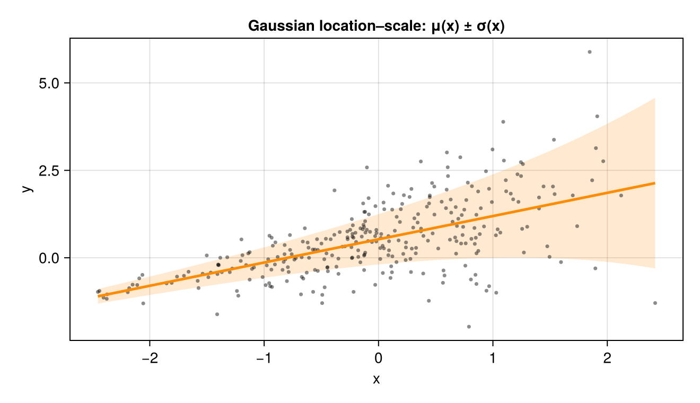
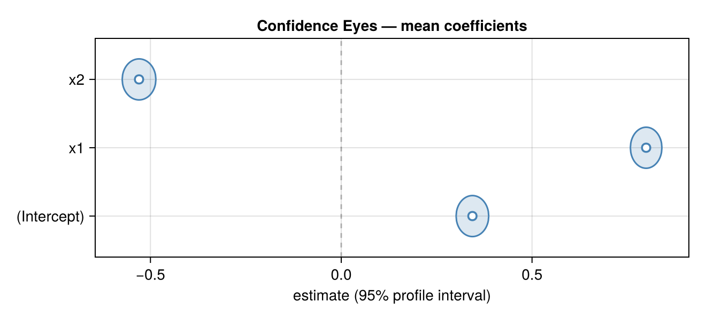

# Figure gallery {#Figure-gallery}

::: tip Status — Stable

Mirrors drmTMB's [Figure gallery](https://itchyshin.github.io/drmTMB/articles/figure-gallery.html). **In DRM.jl today:** publication-quality [CairoMakie](https://docs.makie.org/) figures rendered straight from fitted models, including the **Confidence Eye** (Florence's house contract for interval plots).

:::

Every figure below is rendered at build time from a real `drm` fit — nothing is mocked.

```julia
using DRM, CairoMakie, Random
CairoMakie.activate!(type = "png")   # render-proof raster output
```


## Location–scale: the mean _and_ the spread {#Location–scale:-the-mean-and-the-spread}

A location–scale fit models how both the mean and the residual SD move with a predictor. The ribbon is `μ(x) ± σ(x)` — it widens where the data are noisier, which a mean-only model cannot show.

```julia
Random.seed!(2)
n = 300
x = sort(randn(n))
y = 0.5 .+ 0.7 .* x .+ exp.(-0.3 .+ 0.45 .* x) .* randn(n)   # spread grows with x
fit = drm(bf(@formula(y ~ x), @formula(sigma ~ x)), Gaussian(); data = (; y, x))

β = coef(fit, :mu); γ = coef(fit, :sigma)
xg = range(extrema(x)...; length = 120)
μg = β[1] .+ β[2] .* xg
σg = exp.(γ[1] .+ γ[2] .* xg)

fig = Figure(size = (660, 380))
ax = Axis(fig[1, 1]; xlabel = "x", ylabel = "y",
    title = "Gaussian location–scale: μ(x) ± σ(x)")
band!(ax, xg, μg .- σg, μg .+ σg; color = (:darkorange, 0.18))
scatter!(ax, x, y; color = (:black, 0.45), markersize = 5)
lines!(ax, xg, μg; color = :darkorange, linewidth = 2.5)
fig
```

{width=660px height=380px}

## The Confidence Eye {#The-Confidence-Eye}

DRM.jl draws confidence intervals as **Confidence Eyes** — Florence's house contract: a **pale compatibility region** (the interval), a **darker outline**, and a **hollow point estimate**. The lens is widest at the estimate and tapers to the interval limits, so the eye literally narrows as the evidence sharpens.

Here each mean coefficient of a fit is drawn from its profile-likelihood interval:

```julia
Random.seed!(1)
m = 500
x1 = randn(m); x2 = randn(m)
yc = 0.4 .+ 0.8 .* x1 .- 0.5 .* x2 .+ 0.5 .* randn(m)
fitc = drm(bf(@formula(y ~ x1 + x2), @formula(sigma ~ 1)), Gaussian(); data = (; y = yc, x1, x2))
rows = [r for r in confint(fitc; method = :profile) if r.param === :mu]

"Draw one horizontal Confidence Eye at row `i` spanning [lo, hi], waist at `est`."
function confidence_eye!(ax, i, lo, est, hi; hue = :steelblue, halfheight = 0.30)
    xs = range(lo, hi; length = 80)
    w = [sqrt(max(0.0, (t - lo) * (hi - t))) for t in xs]
    w ./= maximum(w); w .*= halfheight                       # lens half-width
    band!(ax, xs, i .- w, i .+ w; color = (hue, 0.18))       # pale region
    lines!(ax, xs, i .+ w; color = hue, linewidth = 1.5)     # darker outline
    lines!(ax, xs, i .- w; color = hue, linewidth = 1.5)
    scatter!(ax, [est], [i]; marker = :circle, color = :white,
        strokecolor = hue, strokewidth = 1.8, markersize = 11)  # hollow estimate
end

fig2 = Figure(size = (660, 300))
ax2 = Axis(fig2[1, 1]; xlabel = "estimate (95% profile interval)",
    yticks = (1:length(rows), [r.coef for r in rows]),
    title = "Confidence Eyes — mean coefficients")
vlines!(ax2, [0.0]; color = (:black, 0.25), linestyle = :dash)
for (i, r) in enumerate(rows)
    confidence_eye!(ax2, i, r.lower, r.estimate, r.upper)
end
ylims!(ax2, 0.4, length(rows) + 0.6)
fig2
```

{width=660px height=300px}

A Confidence Eye that does not cover the dashed zero line is the visual analogue of a "significant" coefficient — but the eye keeps the whole interval in view, so you read the _magnitude_ and _precision_, not just a yes/no.

## See also {#See-also}
- [Checking and using fitted models](../model-guides/model-workflow.md) — the `confint` rows these eyes are drawn from.
  
- [When variance carries signal](../tutorials/location-scale.md) — the location–scale model.
  
